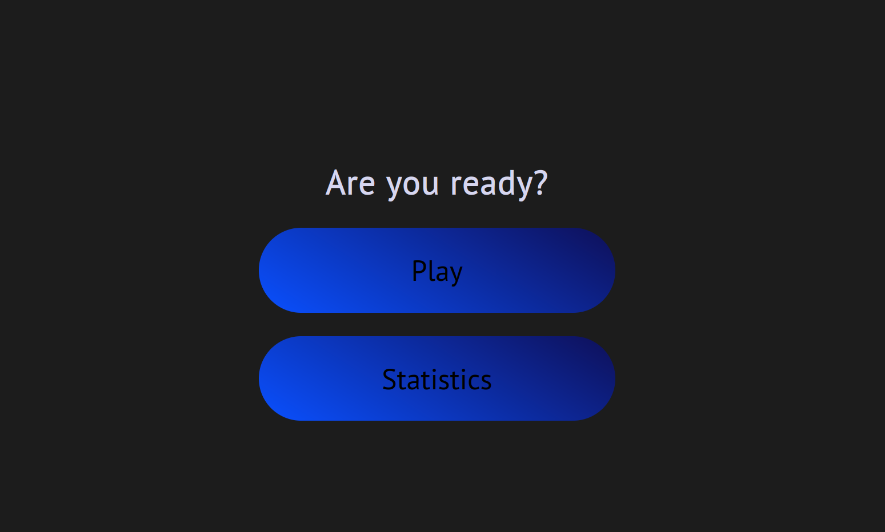
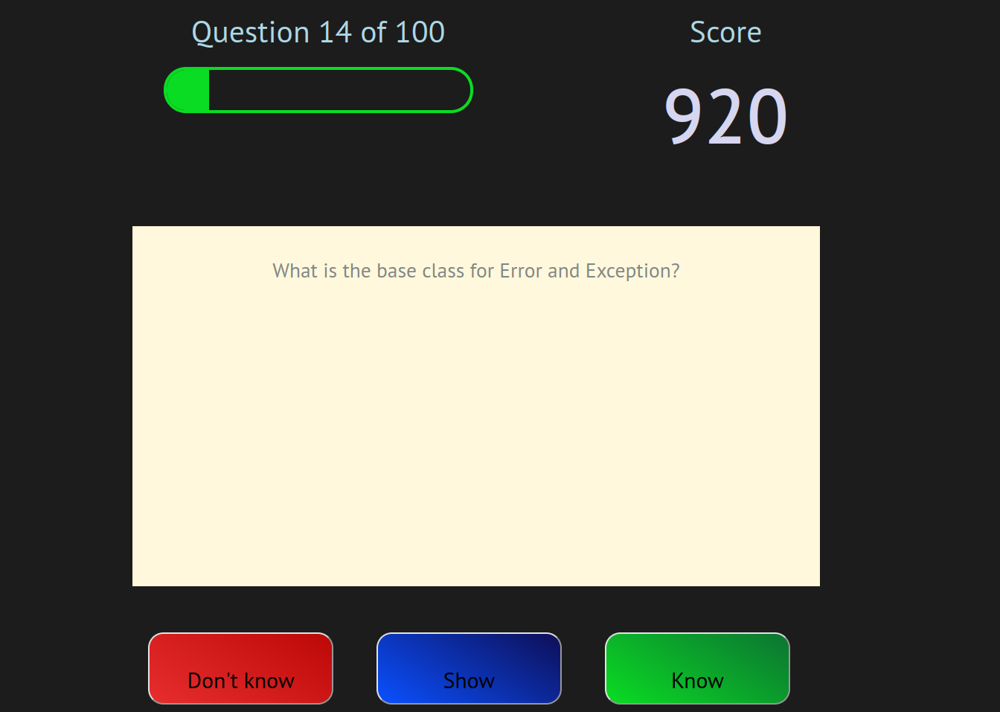
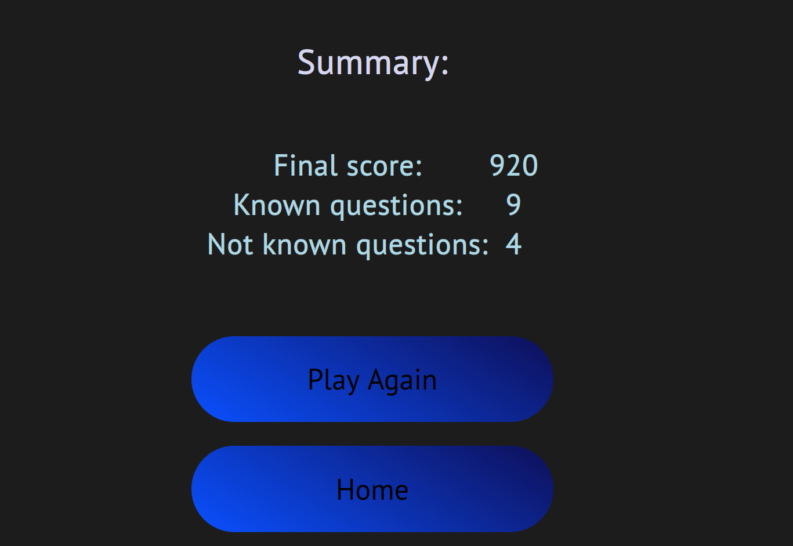
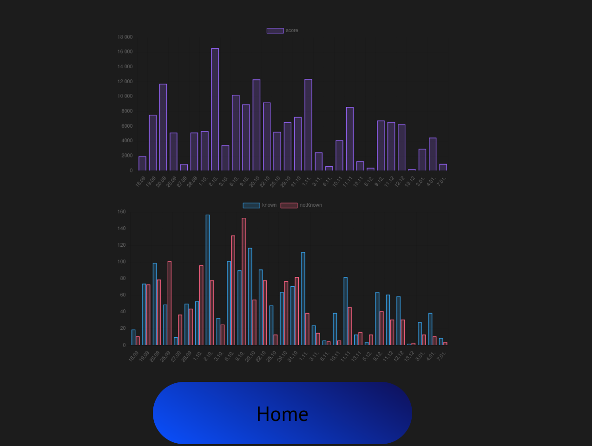

# Flashcards

Simple web application that lets users add their digital flashcards and faster memorize them. 

## Technologies
### Backend
- Node.js
- NeDB in memory database
- Express

### Frontend
- JavaScript
- HTML, CSS

## Screenshots

### Main page

### Flashcards game

### Summary

### Statistics

